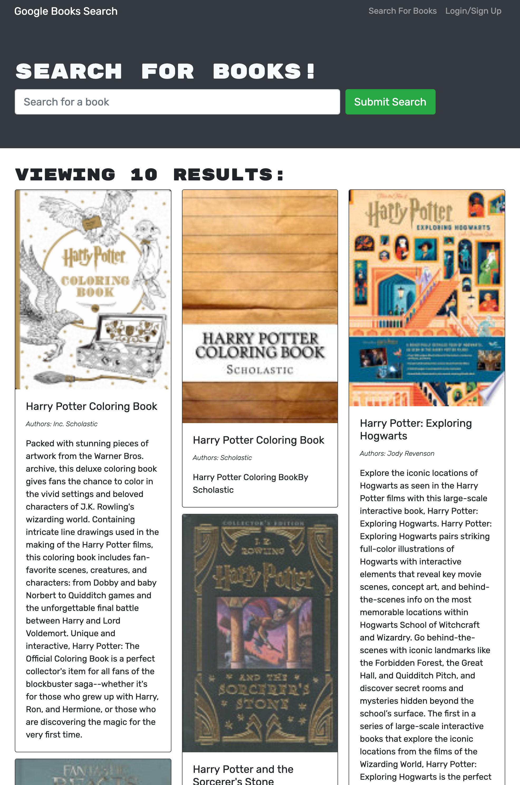

# Book-Search-Engine

An application that allows the user to search their favourite beooks, presenting them with a submit button that then renders the users several search results each featuring a book’s title, author, description, image, and a link to that book on the Google Books site.

# Motivation for this project

Create a Bood Search engine application from a starter code with a fully functioning Google Books API search engine built with a RESTful API, and refactor it to be a GraphQL API built with Apollo Server..

# Reason for this project 

Create application that gives users a fast and easy way to track their money by allowing them to access their finance information anytime while offline.

# What I learned from this project 

In this activity I learnt:

* How to define a GraphQL schema and implement resolvers to handle data population..

* How to write a GraphQL query to read data with and without parameters. 

* How execute queries and mutations using useQuery() and useMutation() Hooks. 

* How to securely transmit data as a JSON object using JWT.

* How to implement server-side authentication in GraphQL API.

# Website

# Contact 

* Name: Consolata Njeri
* Email: Conso4u@gmail.com

